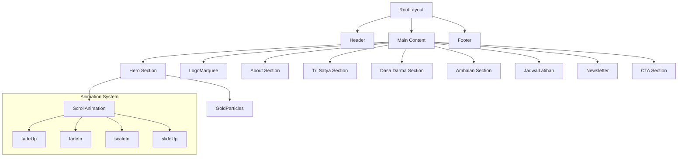

<p align="center">
  
</p>

<h1 align="center">🏕️ Trigantara Official Website</h1>

<p align="center">
  <strong>Website resmi Pramuka Trigantara - SMK Marhas Margahayu</strong><br>
  Membangun karakter generasi emas dengan semangat kepramukaan yang berkelas, berintegritas, dan tak terbatas.
</p>

<p align="center">
  <a href="#-demo"><strong>Demo</strong></a> •
  <a href="#-features"><strong>Features</strong></a> •
  <a href="#-tech-stack"><strong>Tech Stack</strong></a> •
  <a href="#-getting-started"><strong>Getting Started</strong></a> •
  <a href="#-architecture"><strong>Architecture</strong></a> •
  <a href="#-contributing"><strong>Contributing</strong></a>
</p>

<p align="center">
  
  
  
  
  
</p>

---

## 🌟 Demo

| Environment | URL | Status |
|-------------|-----|--------|
| **Production** | [trigantara.com](https://trigantara.com) | 🟢 Live |
| **Development** | `localhost:3000` | 🔧 Local |

---

## ✨ Features

### 🎨 Design & UX
- **Premium Dark Theme** — Luxury gold accent on deep black background
- **Glassmorphism UI** — Modern blur effects and transparent cards
- **Smooth Animations** — Framer Motion powered scroll & hover effects
- **Responsive Design** — Optimized for all devices (Mobile, Tablet, Desktop)
- **Custom Typography** — 4 Google Fonts (Poppins, Inter, Playfair Display, Cinzel)

### 📱 Pages & Sections
| Page | Description |
|------|-------------|
| **Beranda** | Hero section, Tri Satya, Dasa Darma, Ambalan cards, Newsletter |
| **Tentang** | About Trigantara with vision cards |
| **Prestasi** | Achievement showcase |
| **Kegiatan** | Events calendar and past activities |
| **Galeri** | Photo gallery with category filters |
| **Tim** | Team carousel with 3D card effects |
| **Kontak** | Contact form and location info |

### 🔧 Technical Highlights
- **150+ UI Components** — Lightswind & custom components
- **SEO Optimized** — Open Graph, meta tags, sitemap, robots.txt
- **Performance Focused** — Image optimization, lazy loading
- **Accessibility** — Skip links, ARIA labels, keyboard navigation
- **Type Safe** — Strict TypeScript configuration

---

## 🛠️ Tech Stack

### Core Framework
| Technology | Version | Purpose |
|------------|---------|---------|
| [Next.js](https://nextjs.org/) | 16.1.3 | React Framework (App Router) |
| [React](https://react.dev/) | 19.2.3 | UI Library |
| [TypeScript](https://www.typescriptlang.org/) | 5.x | Type Safety |

### Styling & Animation
| Technology | Purpose |
|------------|---------|
| [Tailwind CSS](https://tailwindcss.com/) | Utility-first CSS |
| [Framer Motion](https://www.framer.com/motion/) | Declarative animations |
| [GSAP](https://greensock.com/gsap/) | Advanced animations |
| [Lenis](https://lenis.studiofreight.com/) | Smooth scrolling |

### UI Components
| Technology | Purpose |
|------------|---------|
| [Lightswind](https://lightswind.com/) | Pre-built animated components |
| [Lucide React](https://lucide.dev/) | Icon library |
| [Embla Carousel](https://www.embla-carousel.com/) | Carousel/Slider |

### 3D & Graphics
| Technology | Purpose |
|------------|---------|
| [React Three Fiber](https://docs.pmnd.rs/react-three-fiber) | 3D graphics |
| [Drei](https://github.com/pmndrs/drei) | R3F helpers |

### Utilities
| Technology | Purpose |
|------------|---------|
| [React Hook Form](https://react-hook-form.com/) | Form handling |
| [Axios](https://axios-http.com/) | HTTP client |
| [next-seo](https://github.com/garmeeh/next-seo) | SEO management |

---

## 🚀 Getting Started

### Prerequisites

- **Node.js** 18.0 or higher
- **npm** 9.0+ or **yarn** 1.22+

### Installation

```bash
# Clone the repository
git clone https://github.com/trigantaraofficial/Trigantara_Official_Website.git

# Navigate to project directory
cd Trigantara_Official_Website

# Install dependencies
npm install
```

### Development

```bash
# Start development server with Turbopack
npm run dev

# Open http://localhost:3000
```

### Production Build

```bash
# Create optimized production build
npm run build

# Start production server
npm start
```

### Linting

```bash
# Run ESLint
npm run lint
```

---

## 📐 Architecture

### Project Structure

```
src/
├── app/                          # Next.js App Router
│   ├── layout.tsx                # Root layout with fonts
│   ├── page.tsx                  # Homepage
│   ├── globals.css               # Global styles & design tokens
│   ├── about/                    # /about route
│   ├── achievements/             # /achievements route
│   ├── contact/                  # /contact route
│   ├── events/                   # /events route
│   ├── gallery/                  # /gallery route
│   ├── news/                     # /news route
│   └── team/                     # /team route
│
├── components/
│   ├── layout/                   # Header, Footer
│   ├── lightswind/               # 137 animated UI components
│   └── ui/                       # 13 custom components
│
├── lib/
│   ├── animations.ts             # Animation configurations
│   └── utils.ts                  # Utility functions
│
└── hooks/                        # Custom React hooks
```

### Component Hierarchy



### Design System

#### Color Palette

| Token | Value | Usage |
|-------|-------|-------|
| `--gold` | `#D4AF37` | Primary accent |
| `--gold-light` | `#F4C430` | Hover states |
| `--gold-dark` | `#AA8C2C` | Pressed states |
| `--background` | `#050505` | Page background |
| `--foreground` | `#e0e0e0` | Body text |

#### Typography

| Font | Variable | Usage |
|------|----------|-------|
| Poppins | `--font-poppins` | Primary sans-serif |
| Inter | `--font-inter` | Body text |
| Playfair Display | `--font-playfair` | Headings (serif) |
| Cinzel | `--font-cinzel` | Display/decorative |

---

## 🐳 Deployment

### Railway (Production)

This project is configured for deployment on [Railway](https://railway.app/) with Docker.

```bash
# Build Docker image locally
docker build -t trigantara .

# Run locally
docker run -p 3000:3000 trigantara
```

### Environment Variables

| Variable | Description | Required |
|----------|-------------|----------|
| `NODE_ENV` | Environment mode | Auto-set |
| `PORT` | Server port | Default: 3000 |

---

## 🤝 Contributing

We welcome contributions! Please follow these guidelines:

### Development Workflow

1. **Fork** the repository
2. **Clone** your fork
3. **Create** a feature branch: `git checkout -b feature/amazing-feature`
4. **Make** your changes
5. **Commit** with conventional commits: `git commit -m 'feat: add amazing feature'`
6. **Push** to your branch: `git push origin feature/amazing-feature`
7. **Open** a Pull Request

### Code Style

- Use **TypeScript** for all new files
- Follow **ESLint** rules
- Use **PascalCase** for component files
- Use **camelCase** for utility files
- Add **JSDoc comments** for public APIs

### Commit Convention

| Prefix | Description |
|--------|-------------|
| `feat:` | New feature |
| `fix:` | Bug fix |
| `docs:` | Documentation |
| `style:` | Formatting |
| `refactor:` | Code restructure |
| `perf:` | Performance |
| `test:` | Tests |
| `chore:` | Maintenance |

---

## 📊 Roadmap

### Current Version (v0.1.0)
- [x] Core pages (Home, About, Team, Gallery, Events, Contact)
- [x] Responsive design
- [x] Animation system
- [x] SEO optimization

### Upcoming Features
- [ ] Blog/News CMS integration
- [ ] Admin dashboard
- [ ] Multi-language support (Bahasa Indonesia / English)
- [ ] PWA support
- [ ] Performance optimizations

---

## 📄 License

This project is proprietary software. All rights reserved.

© 2024 - 2026 **Ambalan Trigantara - SMK Marhas Margahayu**

---

<p align="center">
  <strong>Satyaku Kudharmakan • Dharmaku Kubaktikan</strong>
</p>

<p align="center">
  Made with ❤️ by Trigantara Team
</p>
